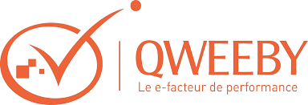
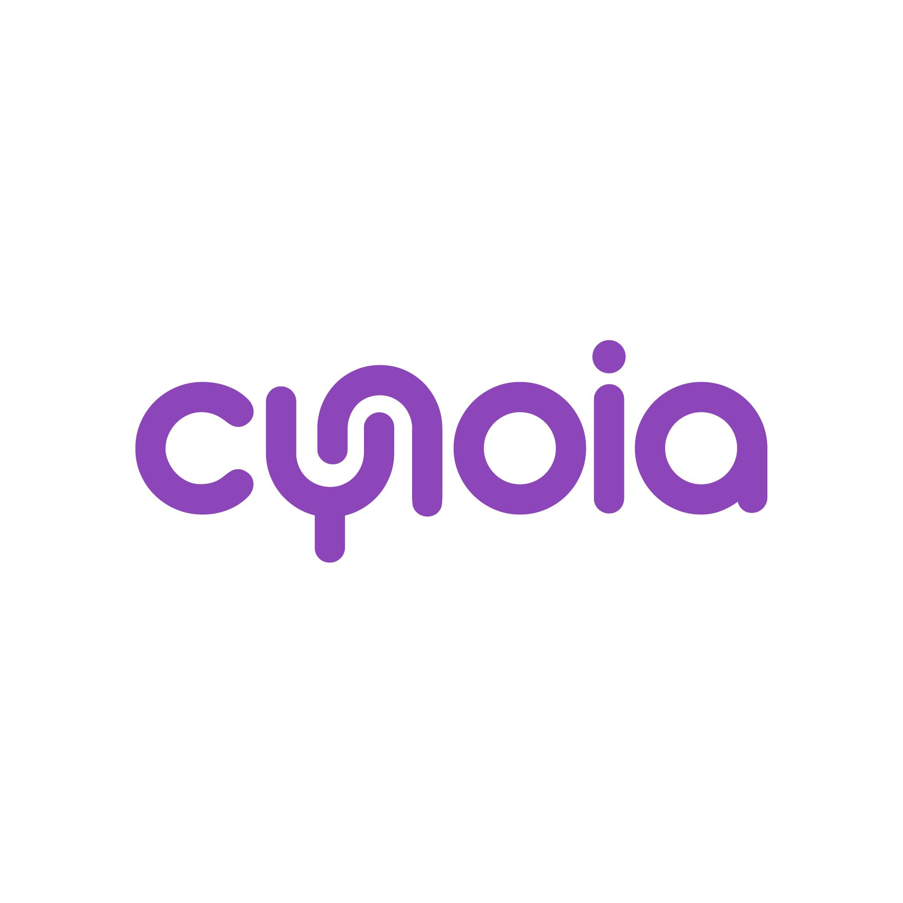

## Ilyes El Ouni

### Full-Stack Engineer · AI & ML · LLM pipelines

[**Portfolio**](https://ilyes-el-ouni.vercel.app/) · [**LinkedIn**](https://www.linkedin.com/in/ilyes-el-ouni-a3681b234) · [**GitHub**](https://github.com/Ilyes-Ouni)

Data Science and AI Engineering (Tek'UP)

---

## Why this profile can look quiet on GitHub

Most impactful work lands in **employer / private repos** or **orgs** (NDAs), so the public graph doesn’t show the full delivery picture. Older coursework and spikes add noise on the timeline. **Pinned repos** plus **[my portfolio](https://ilyes-el-ouni.vercel.app/)** are the best honest signal of what I build today.

---

## What I focus on

| Strength                   | In practice                                                                                           |
| -------------------------- | ----------------------------------------------------------------------------------------------------- |
| **Full-stack engineering** | UIs plus APIs: **React / TS**, **NestJS**, pragmatic boundaries and integration patterns.             |
| **LLM-ready backends**     | Wiring **Groq/OpenAI-class** flows behind structured endpoints (see sample repo below).               |
| **Data ingestion & prep**  | **Python** pipelines for prep and APIs (**FastAPI**, **Streamlit** in pinned work); **Django**/scraping when the use case fits; normalization toward ML and dashboards. |
| **ML/MLOps direction**     | **Python** repos aimed at experimentation and reproducible pipelines (see `bmi-propensity-platform`). |

---

## Trusted by — organizations I’ve worked with

Employers and teams where I’ve contributed in a professional capacity. *Naming is deliberate signal only; depth of work often sits in private repos or under NDA.*

&nbsp;&nbsp;&nbsp;&nbsp;

&nbsp;&nbsp;&nbsp;&nbsp;

#### Geographic reach

  <strong>France</strong> · <strong>Tunisia</strong>

  Western Europe · North Africa <em>remote / hybrid friendly worldwide</em>

---

## Engineering stack (current)

`Python` · `TypeScript` · `React` · `NestJS` · `Node.js` · `Angular` · `Docker` · `PostgreSQL` · `MongoDB` · `Firebase` · `Prisma` · `REST`

  
  
  
  
  
  
  

---

## GitHub · activity

**Contribution graph and pushes** belong to **`@Ilyes-Ouni`**—this profile readme is on the same account. Narrative write-ups and demos live on **[my portfolio](https://ilyes-el-ouni.vercel.app/)**. The repos that best show how I build are listed next.

---

## Public reference repos

Pin **these three** on your profile; they’re the clearest public snapshots of full-stack + ML/BI work.

| Repo                                                                                                   | Role                                                                                                                                    |
| ------------------------------------------------------------------------------------------------------ | --------------------------------------------------------------------------------------------------------------------------------------- |
| **[react-nestjs-groq-example-sample](https://github.com/Ilyes-Ouni/react-nestjs-groq-example-sample)** | **React + NestJS** sample with **Groq** wiring—LLM-behind-API patterns.                                                                 |
| **[bmi-propensity-platform](https://github.com/Ilyes-Ouni/bmi-propensity-platform)**                   | Bank marketing **subscription intelligence**: ML + **FastAPI**, **React** dashboard, **MLflow**, Docker—leakage-aware MLOps end-to-end. |
| **[olist-kpi-forecast-suite](https://github.com/Ilyes-Ouni/olist-kpi-forecast-suite)**                 | **BI + AI** retail lab on the **Olist** dataset—KPIs, forecasting, anomalies, segmentation, **Streamlit** decision dashboard.           |

---

**Internships, collaborations, or full-stack / ML roles?** Connect on **[LinkedIn](https://www.linkedin.com/in/ilyes-el-ouni-a3681b234)** or check the **[portfolio](https://ilyes-el-ouni.vercel.app/)**.

Tunisia · EU/MENA-friendly remote

